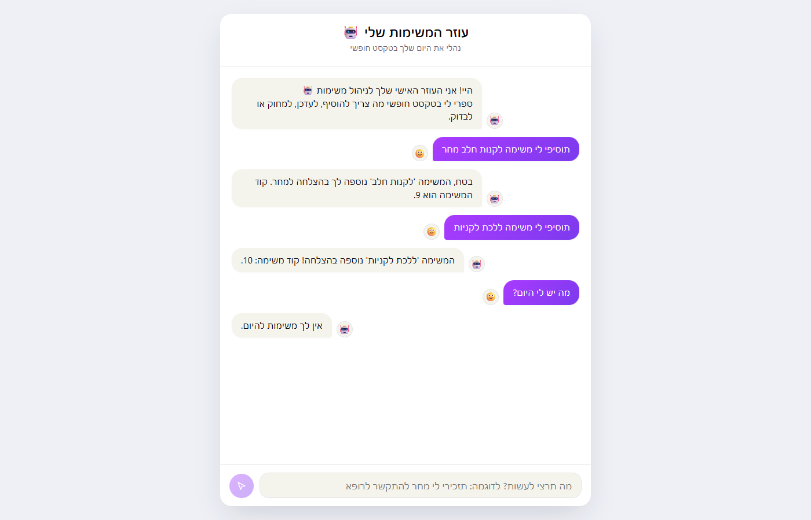

<div align="center">

# 🤖 My Task Manager

**Manage your daily to-dos in plain, free-form text — no forms, no buttons, just conversation.**

[](https://www.python.org/)
[](https://fastapi.tiangolo.com/)
[](https://react.dev/)
[](https://aistudio.google.com/)
[]()



</div>

---

## 📋 Table of Contents

- [Overview](#-overview)
- [Architecture](#️-architecture)
- [Tech Stack](#-tech-stack)
- [Getting Started](#-getting-started)
- [API Reference](#-api-reference)
- [Example Chat Usage](#-example-chat-usage)
- [Project Structure](#-project-structure)
- [Troubleshooting](#-troubleshooting)

## 🧭 Overview

Instead of an app full of forms for viewing, adding, updating, and deleting tasks — everything happens through **free-form conversation with a chatbot**. Just type naturally (e.g. *"remind me to call the doctor tomorrow"*), and an AI agent figures out what you mean, carries out the right action in the system, and replies back in plain language.

The technical core is **Function Calling**: the language model (Gemini) is given a JSON schema describing the functions available in the system. The model decides which one(s) to call and with what arguments, the code actually executes them, and the model turns the result into a natural-language reply.

## 🏗️ Architecture

```
┌──────────────┐      HTTP POST /chat       ┌──────────────┐
│   React UI   │ ─────────────────────────▶ │   FastAPI    │
│  (client/)   │ ◀───────────────────────── │  (main.py)   │
└──────────────┘        JSON response       └──────┬───────┘
                                                     │
                                                     ▼
                                         ┌────────────────────┐
                                         │   agent_service.py  │
                                         │  (Function Calling  │
                                         │  loop against Gemini)│
                                         └─────────┬──────────┘
                                                    │ calls the chosen function
                                                    ▼
                                         ┌────────────────────┐
                                         │   todo_service.py   │
                                         │  (in-memory tasks)  │
                                         └────────────────────┘
```

**Single request flow:**
1. The client sends a free-form `query` to `POST /chat`.
2. `agent_service.agent()` sends the query to Gemini along with the JSON schema of the four functions.
3. Gemini returns which function to call (and with what arguments) — e.g. `get_tasks(title="report")`.
4. The code actually executes that function against `todo_service`.
5. The result is sent back to Gemini to phrase a natural-language reply. If multiple steps are needed (e.g. looking up a task by title before updating it), the loop repeats until the model is ready to answer.
6. The final answer is returned to the client.

## 🛠️ Tech Stack

| Layer | Technology |
|---|---|
| Language model | Gemini (`gemini-2.5-flash`) via Google AI Studio |
| Backend | Python, FastAPI, Pydantic |
| Frontend | React + Vite |
| Storage | In-memory array (no database — this is a demo) |

## 🚀 Getting Started

### Prerequisites

- Python 3.10+
- Node.js 18+
- An API key from [Google AI Studio](https://aistudio.google.com/)

### 1. Set up the API key

Create a `.env` file in the project root:
```
GOOGLE_API_KEY=your-key-here
```

> ⚠️ **Free tier quota**: a brand-new key gets a small daily quota on day one (around 20 requests for `gemini-2.5-flash`). It automatically expands within a day or two, or you can enable billing in Google AI Studio for a much higher quota.

### 2. Run the API server (Python)

```powershell
.\venv\Scripts\Activate.ps1
pip install -r requirements.txt   # first time only
python -m uvicorn main:app --reload
```

The server runs on `http://127.0.0.1:8000`. Interactive API docs (Swagger) are available at `http://127.0.0.1:8000/docs`.

### 3. Run the chat client (React, bonus)

In a separate terminal:
```powershell
cd client
npm install   # first time only
npm run dev
```

This opens a link (usually `http://localhost:5173`) with the chat app.

## 🔌 API Reference

| Route | Method | Body | Response |
|---|---|---|---|
| `/chat` | `POST` | `{ "message": "string" }` | `{ "response": "string" }` |

Example (Postman / curl):
```
POST http://127.0.0.1:8000/chat
Content-Type: application/json

{ "message": "Add a task to buy milk tomorrow" }
```

## 💬 Example Chat Usage

| What you type | What happens |
|---|---|
| "Add a task to write the report, due next Sunday" | Creates a new task with a computed due date |
| "What's coming up this week?" | Fetches tasks filtered by a date range |
| "Mark the report task as done" | Looks up the task by title, then updates its status |
| "Delete the milk shopping task" | Looks up the task by title, then deletes it |

## 📁 Project Structure

```
.
├── main.py              # FastAPI server — entry point, POST /chat
├── agent_service.py     # Agent logic (function calling against Gemini)
├── todo_service.py      # In-memory task management (get/add/update/delete)
├── requirements.txt
├── .env                 # API key (not in git)
└── client/              # React app (bonus)
    ├── src/App.jsx       # Chat UI
    └── .env              # VITE_API_URL
```

## 🩹 Troubleshooting

**"address already in use" when running uvicorn**
A previous process is still bound to the port. Stop it, or run on a different port: `--port 8001` (and update `VITE_API_URL` in `client/.env` to match).

**PowerShell doesn't recognize `venv\Scripts\python.exe`**
Prefix the path with `.\` (i.e. `.\venv\Scripts\...`) — this is a built-in PowerShell safety feature against running files from a relative path.

**429 / RESOURCE_EXHAUSTED error from Gemini**
The daily free-tier quota has been used up. See the quota note above.

---

<div align="center">

### 👩‍💻 Author

**Yehudit Pollock**
[GitHub](https://github.com/yt314) · [Email](mailto:y556780305@gmail.com)

</div>
